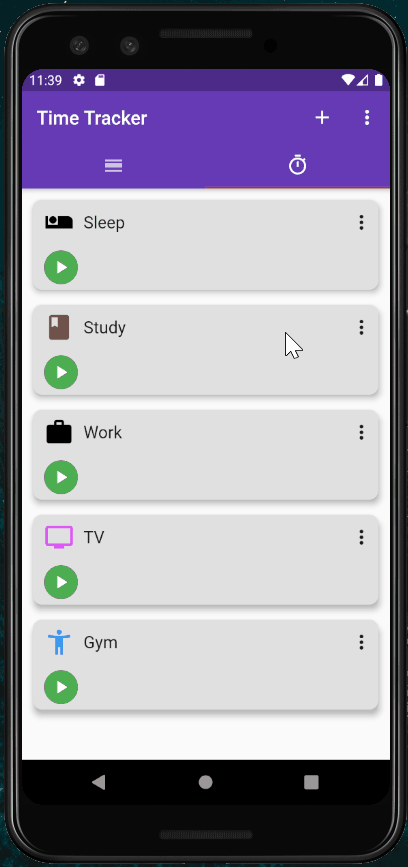

# time_tracker

This is a Time Tracker app I made in Flutter completely from scratch, it's purpose (although it still lacks a lot of planned features) is to help track daily time spent on different activities. I chose Provider for state management, and used Listview.builder for generating activities on demand.
This app was made more as a practice app which I solely built and took a lot of inspiration from Time Tracker app on Google Play Store => 
( https://play.google.com/store/apps/details?id=zzz1zzz.tracktime&hl=en )

